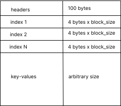

# Database File Format

This is a description of the file format.

## Features

This database is basically a hashtable with its 'underlying array' as the database file. It should thus have the
following features:

- It should be able to have its sections mapped to memory. Each section should be of OS VM page size as done
  by [lmdb](https://lmdb.readthedocs.io/en/release/#storage-efficiency-limits). To get the OS VM page size in a
  cross-platform way, we could use what [page_size crate](https://docs.rs/page_size/latest/page_size/) used.
- All data is saved in bytes
- It should have the following major sections:
    - a 100-byte header to hold metadata for the database
    - a series of consecutive index blocks. They are `round_up(max_keys / (block_size / 4))` where `(block_size / 4)` is
      items in each index block since each item is a 4-byte offset (offset is described below).
    - a series of key-value entries

- The 100-byte header, similar to [sqlite](https://www.sqlite.org/fileformat.html#the_database_header) contains:

| Offset | Size |                                                                                  Description                                                                                   |
|:------:|:----:|:------------------------------------------------------------------------------------------------------------------------------------------------------------------------------:|
|   0    |  16  |                                                                     The header string: "Scdb versn 0.001"                                                                      |
|   16   |  4   | `block_size` - the database page size in bytes. Must be a power of two, as got in a similar way to how [page_size crate](https://docs.rs/page_size/latest/page_size/) does it. |
|   20   |  8   |                                        `max_keys` - maximum number of keys (saved as a 4 byte number). Defaults to 1000,000 (1 million)                                        |
|   28   |  2   |                    `redundant_blocks` - number of redundant index blocks to cater for where all index blocks are filled up for a given hash. Defaults to 1.                    |
|   30   |  8   |                    `last_offset` - the last key-value entry offset: Defaults to `800 + (number_of_items_per_index_block * 4 * 8 * number_of_index_blocks)`.                    |
|   38   |  62  |                                                                     Reserved for expansion. Must be zero.                                                                      |

- The index blocks each contain offsets where an offset is how far in bits from the start of the file that you will find
  the corresponding key-value entry.
- Each key-value entry has the following parts all in binary format
    - `KEY SIZE <the 4 byte unsigned integer showing number of bits for this key>`
    - `KEY <the key>`
    - `EXPIRY <the timestamp>` (optional)
    - `DELETED <a 1 bit flag, 1 if deleted, 0 if not>`
    - `VALUE SIZE <the 4 byte unsigned integer showing number of bits for this value>`
    - `VALUE <the value in binary>`

## Acknowledgements

- Ideas are borrowed from [rds file format](https://rdb.fnordig.de/file_format.html)
  , [sqlite file format](https://www.sqlite.org/fileformat.html)
  and [lmdb file format](https://blog.separateconcerns.com/2016-04-03-lmdb-format.html)